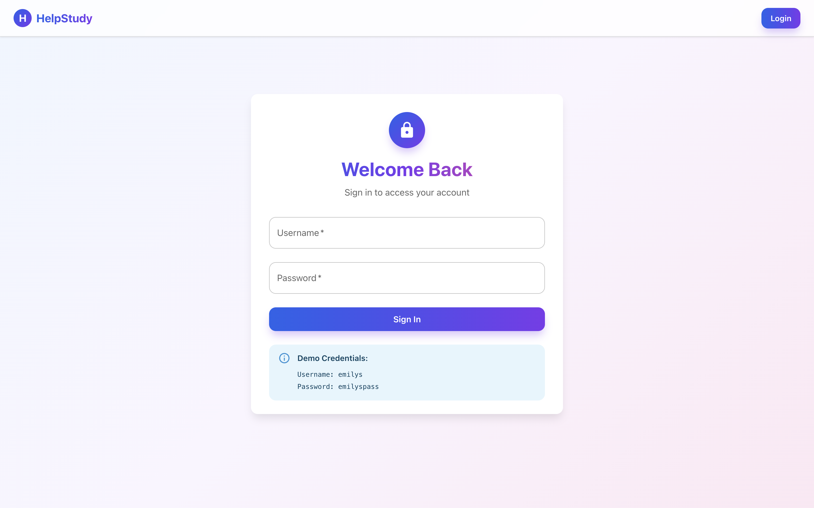
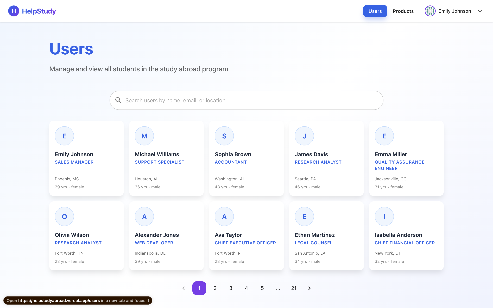
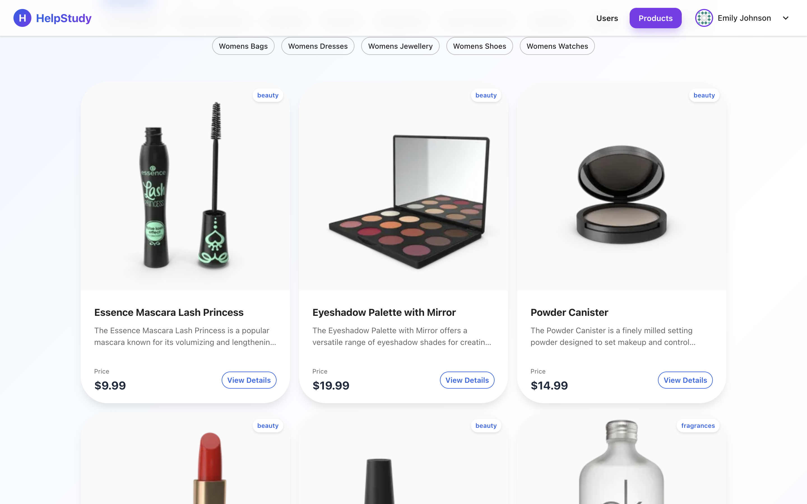

# HelpStudy Abroad

A comprehensive platform for managing study abroad programs, connecting students, and showcasing educational products.


## 🚀 Features

*   **User Management:** Browse, search, and view detailed profiles of students and alumni.
*   **Product Showcase:** Explore educational resources and products with a clean, modern interface.
*   **Smart Matching:** AI-driven program recommendations based on user profiles.
*   **Secure Authentication:** Robust login system with session management via HTTP-only cookies.
*   **Responsive Design:** Fully optimized for desktop, tablet, and mobile devices.

## 🛠️ Tech Stack

*   **Frontend:** [Next.js 14](https://nextjs.org/) (App Router), [React](https://react.dev/)
*   **Styling:** [Material UI (MUI)](https://mui.com/), [Tailwind CSS](https://tailwindcss.com/)
*   **State Management:** [Zustand](https://github.com/pmndrs/zustand)
*   **API Integration:** [DummyJSON](https://dummyjson.com/) (Proxied via Next.js API routes)
*   **Authentication:** Custom JWT-based auth with middleware protection.

## 📸 Screenshots

### Login Page
Clean and secure login interface with validation.


### User Directory
Searchable grid of student profiles with pagination.


### Product Catalog
Showcase of educational products with search and filtering.


## 🏁 Getting Started

Follow these steps to set up the project locally.

### Prerequisites

*   Node.js 18+ 
*   npm or yarn

### Installation

1.  **Clone the repository:**
    ```bash
    git clone https://github.com/yourusername/helpstudyabroad.git
    cd helpstudyabroad
    ```

2.  **Install dependencies:**
    ```bash
    npm install
    # or
    yarn install
    ```

3.  **Run the development server:**
    ```bash
    npm run dev
    # or
    yarn dev
    ```

4.  **Open the application:**
    Navigate to [http://localhost:3000](http://localhost:3000) in your browser.

## 🔐 Credentials (Demo)

Use the following credentials to log in:

*   **Username:** `emilys`
*   **Password:** `emilyspass`

## 📂 Project Structure

```
├── app/                  # Next.js App Router pages and layouts
│   ├── api/              # API routes (proxy logic)
│   ├── login/            # Login page
│   ├── products/         # Product listing & details
│   ├── users/            # User listing & details
│   ├── actions.js        # Server Actions (e.g., logout)
│   └── page.js           # Landing page
├── components/           # Reusable UI components (Navbar, Client wrappers)
├── lib/                  # Utility functions (auth, API helpers)
├── store/                # Distant state stores (User, Product, Auth)
└── public/               # Static assets
```

